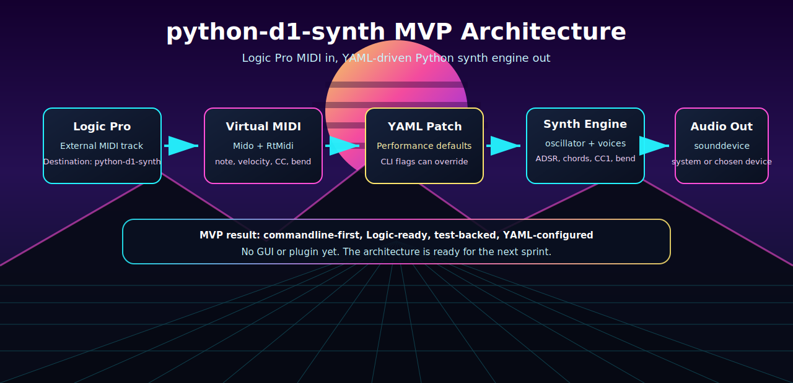

# python-d1-synth

**Afrikaanse vinnige gids vir Logic Pro gebruikers wat geen Python- of opdragreel-ervaring het nie.**

`python-d1-synth` is 'n klein, getoetste Python-synth MVP. Die doel is eenvoudig: Logic Pro of 'n ander DAW stuur MIDI na `python-d1-synth`, en die Python-kode maak hoorbare klank deur jou gekose klankuitset.

Die MVP is op 2026-07-14 aanvaar. Dit is nog nie 'n AU-, VST3- of Logic Component-inprop nie, en dit is nog nie 'n grafiese lessenaarprogram nie. Dit is die werkende tegniese kern: MIDI in, synth-engine, klank uit, YAML-konfigurasie, toetse, dokumentasie en naspeurbare user stories.

[Engelse README](README.en.md)



## Wat Kan Die MVP Doen?

- Begin as 'n gewone Python-opdragreelprogram.
- Speel klank vanaf Logic Pro se `External MIDI` roete.
- Maak `python-d1-synth` sigbaar as 'n virtuele MIDI-bestemming.
- Speel enkel note, melodiee, akkoorde en eenvoudige triads.
- Gebruik sine, saw en square golfvorms.
- Ondersteun stereo, links en regs klankuitset.
- Onderdruk dubbele MIDI-events uit Logic/CoreMIDI roetes.
- Gebruik note-on en note-off vir vasgehoue note.
- Ondersteun pitch bend, CC1 vibrato-modulasie, CC64 sustain pedal, release fade en ADSR amplitude-instellings.
- Laai uitvoerinstellings uit `examples/midi_performance_patch.yaml`.
- Laat opdragreel-opsies die YAML-instellings tydelik oorskryf.

## Vir Wie Is Hierdie Repo?

Hierdie repo is geskryf vir drie groepe:

- Logic Pro gebruikers wat die synth wil probeer sonder om eers plugin-ontwikkeling te leer.
- Python ontwikkelaars wat 'n skoon, class-based MIDI/audio prototipe wil bestudeer.
- Tegniese beoordelaars wat wil sien dat die MVP professioneel, toetsbaar en Agile-naspeurbaar gebou is.

As jy nie Terminal of PowerShell ken nie: volg die stappe hieronder stadig en kopieer die opdragte presies. Jy hoef nie in die `src` gids in te gaan nie.

## Voor Jy Begin

Jy gaan drie dinge gebruik:

- **Python**: die programtaal waarin die synth geskryf is.
- **Terminal of PowerShell**: die venster waarin jy opdragte tik.
- **Virtuele omgewing**: 'n plaaslike Python-omgewing binne die projekmap, sodat installasies nie jou hele rekenaar verander nie.

Belangrik: al die gewone opdragte hieronder word uit die hoofmap van die projek uitgevoer. Dit is die map waar `README.md`, `pyproject.toml`, `src` en `examples` langs mekaar staan.

## Stap 1: Installeer Python

Installeer Python 3.11 of nuwer vanaf [python.org](https://www.python.org/downloads/).

Op macOS, toets daarna:

```bash
python3 --version
```

Op Windows, toets daarna:

```powershell
py --version
```

As Windows se Python-installeerder vra, merk **Add Python to PATH** aan.

## Stap 2: Kry Die Projek

As jy Git het:

```bash
git clone https://github.com/pappavis/python-d1-synth.git
cd python-d1-synth
```

As jy nie Git het nie:

1. Open die GitHub-bladsy in jou webblaaier.
2. Kies **Code**.
3. Kies **Download ZIP**.
4. Pak die ZIP uit.
5. Open Terminal of PowerShell in die uitgepakte `python-d1-synth` map.

## Stap 3: Maak 'n Virtuele Omgewing

macOS of Linux:

```bash
python3 -m venv .venv
source .venv/bin/activate
python -m pip install --upgrade pip
python -m pip install -e ".[midi]"
```

Windows PowerShell:

```powershell
py -3.11 -m venv .venv
.\.venv\Scripts\Activate.ps1
python -m pip install --upgrade pip
python -m pip install -e ".[midi]"
```

As PowerShell aktivering blokkeer, voer hierdie een keer uit:

```powershell
Set-ExecutionPolicy -Scope CurrentUser RemoteSigned
```

Maak daarna 'n nuwe PowerShell-venster oop en aktiveer weer:

```powershell
.\.venv\Scripts\Activate.ps1
```

Jy weet die virtuele omgewing is aktief wanneer jy iets soos `(.venv)` voor jou prompt sien.

## Stap 4: Toets Dat Die Installering Reg Is

Tik uit die projek se hoofmap:

```bash
python -m synth --help
```

As jy `No module named synth` kry, beteken dit gewoonlik een van hierdie dinge:

- Die virtuele omgewing is nie aktief nie.
- Jy het nog nie `python -m pip install -e ".[midi]"` uitgevoer nie.
- Jy is nie in dieselfde Python-omgewing waarin jy die projek geinstalleer het nie.

Oplossing:

```bash
python -m pip install -e ".[midi]"
python -m synth --help
```

Moenie na die `src` gids beweeg om hierdie fout te probeer oplos nie. Die regte oplossing is om die pakket in jou aktiewe virtuele omgewing te installeer.

## Stap 5: Kies Klankuitset In YAML

Open hierdie bestand:

```text
examples/midi_performance_patch.yaml
```

Soek:

```yaml
audio_device: null
```

Jy het twee veilige keuses:

- Los dit as `null` om jou stelsel se standaard-klankuitset te gebruik.
- Vervang `null` met die presiese naam van jou eie klankuitset.

Jy kan beskikbare klanktoestelle lys met:

```bash
python -m synth audio list-devices --debuglevel light
```

Gebruik jou eie toestelnaam. Hierdie repo maak geen aanname oor watter klankkaart, USB-koppelvlak of luidsprekers jy het nie.

## Stap 6: Start Die Synth

Voer hierdie opdrag uit die projek se hoofmap uit:

```bash
python -m synth midi play-stream --config examples/midi_performance_patch.yaml
```

Laat die opdrag oop staan. Dit open die virtuele MIDI-bestemming `python-d1-synth`.

Stop later met:

```text
Ctrl-C
```

As jy `FileNotFoundError` vir `examples/midi_performance_patch.yaml` kry, is jy waarskynlik nie in die projek se hoofmap nie. Gaan terug na die map waar `examples` sigbaar is, en voer die opdrag weer uit.

## Stap 7: Route Logic Pro Na Die Synth

In Logic Pro:

1. Maak 'n nuwe track.
2. Kies `MIDI`.
3. Kies `External MIDI`.
4. Kies by `MIDI Destination` die bestemming `python-d1-synth`.
5. Kies by `MIDI Channel` die waarde `All` of `1`.
6. Maak 'n klein MIDI region met 'n paar note, byvoorbeeld C, E en G.
7. Druk Play.

Verwagte resultaat: jy hoor die Python-synth deur die klankuitset wat in YAML gekies is, of deur jou stelsel se standaard-klankuitset as `audio_device: null` bly.

## Belangrike Opdragte

Start die Logic/DAW performance mode:

```bash
python -m synth midi play-stream --config examples/midi_performance_patch.yaml
```

Oorskryf die YAML-klanktoestel net vir een run:

```bash
python -m synth midi play-stream --config examples/midi_performance_patch.yaml --audio-device "<jou-klanktoestel-naam>"
```

Wys meer diagnose:

```bash
python -m synth midi play-stream --config examples/midi_performance_patch.yaml --debuglevel verbose
```

Speel 'n enkele toetsnoot sonder Logic:

```bash
python -m synth play --note C3 --duration 1.0 --channel stereo --debuglevel light
```

Speel 'n klein toetsreeks sonder Logic:

```bash
python -m synth play --testsequence "ACGD" --duration 0.25 --debuglevel light
```

Render 'n WAV-bestand:

```bash
python -m synth render examples/patch.yaml --output outputs/demo.wav --debuglevel light
```

Lys klanktoestelle:

```bash
python -m synth audio list-devices --debuglevel light
```

Lys MIDI-toestelle:

```bash
python -m synth midi list-devices --unsafe-rtmidi-scan --debuglevel light
```

## YAML Eerste, Opdragreel Wanneer Nodig

Die aanbevole MVP-werkvloei is:

1. Hou stabiele instellings in `examples/midi_performance_patch.yaml`.
2. Start met `python -m synth midi play-stream --config examples/midi_performance_patch.yaml`.
3. Gebruik ekstra opdragreel-opsies net vir tydelike toetse.

Voorrang is:

1. Opdragreel-opsie.
2. YAML-waarde.
3. Ingeboude veilige standaard.

Hierdie opdrag oorskryf byvoorbeeld net tydelik die debugvlak:

```bash
python -m synth midi play-stream --config examples/midi_performance_patch.yaml --debuglevel verbose
```

## Algemene Probleme

**Fout: `No module named synth`**

Die pakket is nie in die aktiewe Python-omgewing geinstalleer nie. Aktiveer `.venv` en voer uit:

```bash
python -m pip install -e ".[midi]"
```

**Fout: `FileNotFoundError: examples/midi_performance_patch.yaml`**

Jy is nie in die projek se hoofmap nie. Gaan na die map waar `examples` sigbaar is, en start weer.

**Logic wys nie `python-d1-synth` nie**

Die Python-opdrag moet reeds loop voordat Logic die bestemming kan sien. Start eers:

```bash
python -m synth midi play-stream --config examples/midi_performance_patch.yaml
```

Maak daarna die Logic MIDI destination lys weer oop.

**Daar is geen klank nie**

Kontroleer:

- Is `audio_device` in YAML `null`, of is dit jou presiese klanktoestelnaam?
- Is jou stelsel se klankuitset reg gekies?
- Stuur Logic na `python-d1-synth`?
- Is die MIDI channel `All` of `1`?
- Speel `python -m synth play --note C3 --duration 1.0` wel klank?

## Wat Die MVP Bewys

Die kernroete werk end-tot-end:

```text
Logic Pro MIDI region
  -> virtuele MIDI-bestemming python-d1-synth
  -> MIDI normalisering
  -> NoteEvent en voice model
  -> oscillator en mixer
  -> Python klankuitset
```

Die ontwikkelproses is ook bewys:

- User stories `US-001` tot `US-042` is gedokumenteer.
- Die Markdown user-story dokument bevat nou die volle backlog sodat Excel nie nodig is om die scope te verstaan nie.
- Die Kanban workbook bly beskikbaar vir spreadsheet-gebruikers.
- Toetse dek kernlogika met fake backends waar hardeware nie beskikbaar is nie.
- Logic Pro en MIDI-hardeware gedrag is deur Product Owner toetse bevestig.

## Huidige Beperkings

- Nog geen AU-, VST3- of Logic Component-inprop nie.
- Nog geen verpakte macOS- of Windows-lessenaarprogram nie.
- Nog geen grafiese synth-paneel nie.
- Nog geen volledige Behringer D / Model D styl filter- en modulasiestem nie.
- Produksie-lae-latency klankwerk benodig nog 'n dieper audio-engine sprint.
- Windows MIDI/audio gedrag moet nog op 'n werklike Windows-masjien bevestig word.

## Dokumentasie

Kernartefakte:

- [MVP Scope](docs/mvp_scope.md)
- [User Stories](docs/user_stories.md)
- [Acceptance Criteria](docs/acceptance_criteria.md)
- [Sprint Lessons Learned And Review](docs/sprint_lessons_learned_review_v0.1.0.md)
- [MVP Sprint Review](docs/mvp_sprint_review_v0.1.0.md)
- [MVP Retrospective](docs/mvp_retrospective_v0.1.0.md)
- [Kanban Workbook](outputs/CHATOD-20260709-D1PY-MVP-001/python_d1_synth_sprint_1_kanban_backlog.xlsx)
- [Engelse README](README.en.md)

Belangrike MIDI/DAW dokumente:

- [MIDI Learning Path](docs/midi_learning_path_v0.1.0.md)
- [Virtual MIDI Port For Logic/DAW](docs/virtual_midi_port_logic_daw_v0.1.0.md)
- [Logic/DAW Virtual MIDI Audio Trigger](docs/virtual_midi_audio_trigger_v0.1.0.md)
- [Live/Streaming MIDI Playback Loop](docs/live_streaming_midi_playback_loop_v0.1.0.md)
- [Sustained Note Audio Engine](docs/sustained_note_audio_engine_v0.1.0.md)
- [MIDI Pitch Bend Mapping](docs/midi_pitch_bend_mapping_dsp_v0.1.0.md)
- [MIDI Modulation CC1 Mapping](docs/midi_modulation_cc1_mapping_dsp_v0.1.0.md)
- [MIDI Performance Patch YAML Config](docs/midi_performance_patch_yaml_config_v0.1.0.md)

## Ontwikkelaars

Voer alle toetse uit:

```bash
python -m pytest
```

Voer net dokumentasie-toetse uit:

```bash
python -m pytest tests/test_docs.py
```

Voer die hardeware MIDI-toets net uit wanneer MIDI-hardeware gekoppel is:

```bash
PYTHON_D1_RUN_HARDWARE_MIDI=1 python -m pytest tests/test_hardware_midi.py -s
```

Die projekreels bly:

- Class-based implementasie.
- Geen globale toepassingstaat nie.
- Red/green toetse per user story.
- Naspeurbaarheid in code en docs vir story-werk.
- Runtime device discovery en YAML-konfigurasie in plaas van hardcoded hardeware-name.

## Volgende Sprint Idees

Die MVP is klaar genoeg om nou bewustelik een rigting te kies:

- **Synth karakter:** filter cutoff/resonance, envelope-to-filter en ryker oscillator gedrag.
- **Gebruiksgemak:** klein desktop UI of patch manager.
- **Aflewering:** verpakte macOS- en Windows-program.
- **Plugin pad:** AU/VST3 haalbaarheidsondersoek.
- **Hardeware pad:** CircuitPython/ESP32 haalbaarheidsondersoek.

## Lisensie

MIT. Sien [LICENSE](LICENSE).
